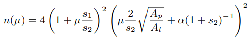
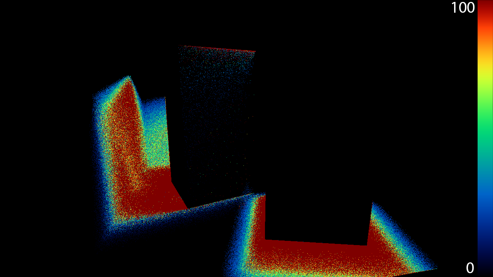
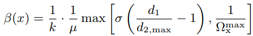
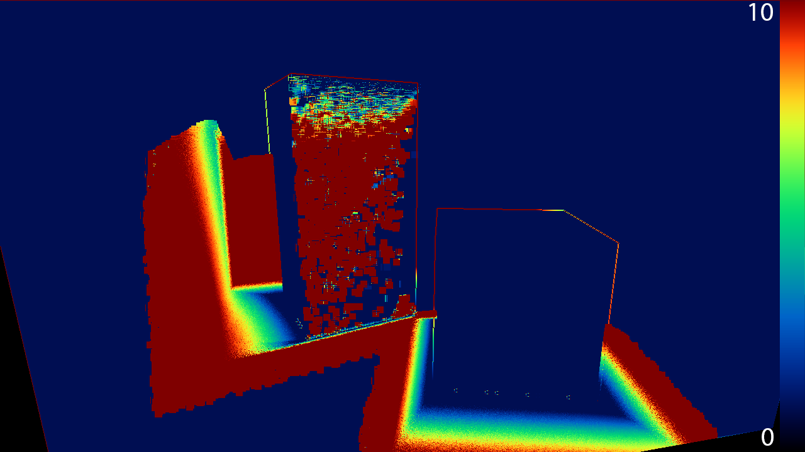
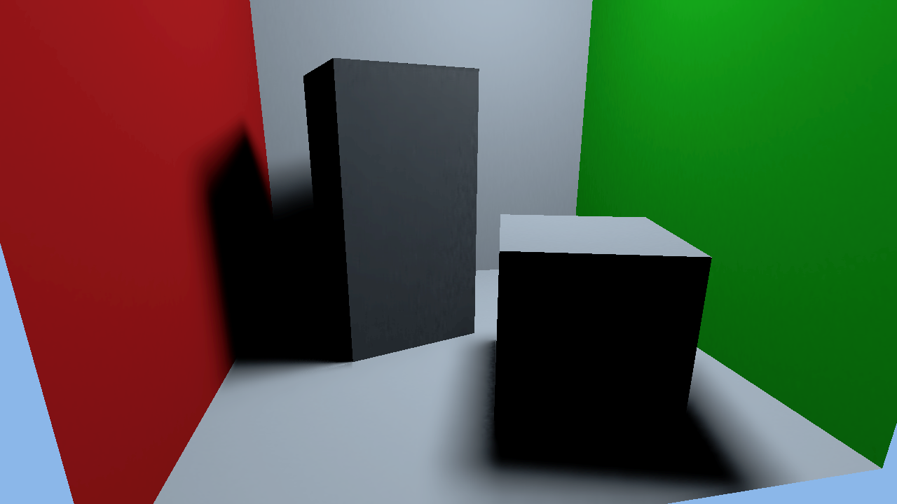

# Implementation of Axis-Aligned Filtering for Interactive Sampled Soft Shadows
## by Asbjoern Lystrup and Marcus Loo Vergara

## Background

This page details our implementation of soft shadows based on the paper [*Axis-Aligned Filtering for Interactive Sampled Soft Shadows*](http://graphics.berkeley.edu/papers/UdayMehta-AAF-2012-12/) by Soham Uday Mehta, Brandon Wang, and Ravi Ramamoorthi. The paper describes a method based on Monte Carlo rendering which approximates soft shadows, by analysing the Fourier spectrum of the occlusion function, and thereby doing smart sampling and reconstruction of the shadows. Here's a quick summary of the method:

  

Given a planar area light source, we sample the distances from the geometry to the light source, and the max and min distance from the occluder to the light source, shown in the figure above as d1, d2 respectively. This gives us the 2 dimensinal occlusion function (b), on which we can calculate the Fourier spectrum (c). Figure (c) shows that the occlusion function (shadows) can confined within a double-wedge which is be described in terms of _d1_ and _d2_. By only considering samples within this double-wedge, we can substantially reduce the amount of samples we need for a good reconstruction by blurring more at high-frequency regions than in low-frequency regions  - this is the main idea of the paper.

The paper's method derives from recent work on frequency analysis and sheared filtering for offline soft shadows. The paper develops a theoretical analysis for axis-aligned filtering. After setting up the foundation of the implementation, we spent some time studying fourier spectrums to get a better idea of the paper's theory.

## Implementation

The implementation can be found [here](https://github.com/bitsauce/Axis-Aligned-Filtering-for-Interactive-Sampled-Soft-Shadows-Implementation). Our implementation uses NVIDIA's [OptiX](https://developer.nvidia.com/optix) to do real-time raytracing.

### Sample Distances

In our implementation, we start off by casting one ray per pixel to find the primary geometry hit. From this hit location, we now cast 9 rays per pixel towards 9 random points the area light source. This gives us values for _d2_max_ and _d2_min_ as illustrated below.

  

(a) shows the values of _d1_ for every pixel, and is just the Euclidean distance from the primary geometry hit to the center of the light source. (b) shows the smallest distance from the closest occluder to the light source out of the 9 _d2_ values that were sampled. Conversely, (c) shows the maximum _d2_ that was sampled out of the 9. We observe that _d2_min_ is biggest near the corners of the boxes. This makes sense since, in corners, most rays hit the box pretty far from the light source. In areas away from the box, _d2_min_ and _d2_max_ vary a lot more than in corners. We will exploit this to apply a spatially varying gaussian blur later.

  

While we sample the 9 values for _d2_, we also sample the intensity of the color, giving us the noisy output we will blur later, as seen above.

### Adaptive Sampling

So, now we have _d1_, _d2_min_ and _d2_max_. At this point we calculate the number of additional samples using the formula given in the paper:

  

This tells us how many extra samples to do. The idea is that we need more information in high-frequency areas, so we do additional samples in those regions. In our implementation, we decided to limit the maximum number of samples to 100 for practical purposes. We also update the color, _d1_, _d2_min_ and _d2_max_ as we're doing these additional samples. The figure below shows a visualization of the adaptive sampling.

  

We can see here that it will sample more in more complex regions, improving the quality of shadows.

After obtaining our values of _d2_, we also do 2D a gaussian average over _d1_ and _d2_ in a 5-pixel radius. This is to remove some noise introduced by pixels completely unoccluded pixels.

### Standard Deviation Calculation

Now we can finally calculate the standard deviation of the gaussian blur which is to be applied over the screen. This value is given by the following formula:

  

Below is a visualization of the betas we obtained:

  

Here we can clearly see that this method will blur more on the outer edges of the shadows, giving the shadows a nice looking penumbra after blurring. 

### Image-Space Blur

  

We apply the betas we calculated from the previous step to do a spatially-varying gaussian blur in image-space, given by the formula above. Beta correspond to the standard deviations of the gaussian blur at a given pixel. We also need to calculate the projected distance _||x-x'||_. This value represents the distance between the pixels, parallel to the light plane. To compute this, we created a change-of-basis matrix using the light's vectors, with the normal vector in the third column, then multiplied it by each pixel's world position and discarded the z-component.

Finally, we separate the gaussian blur a horizontal pass and a vertical pass. To avoid blurring across objects, compare the object ID and surface normal of the pixel before applying the blur. This produces the final image:

  

## Results

As of this time, we had quite decent results, and we held a presentation of our project in class. Our filtering used gaussian offsets corresponding to image-space pixel positions. We had started writing code for world-space based gaussian offsets, but it wasn't complete, so we continued to work on this. In the filter passes, we used the distance between the center pixel and the neighboring pixels' light-parallel positions as gaussian offsets, in accordance to the theory of the paper. Surprisingly enough, the results we obtained were nearly identical to the results from the original image-space offsets, also when comparing the disparity maps. So you could skip this step and use the image-space offsets to get a small performance boost, but this might also cause you to run into artefacts under certain scenarios as it is not as physically accurate as the world-space based offsets.

In addition to this, we added some new models to better test self-shadowing and complex shadows. We extended our filter's object ID check to also compare normals; each sample is required to be within a specified angle of the center sample to be included in the blurred result. We also added a filter that averages the occlusion distances in a 10x10 pixel area for completely unoccluded pixels to reduce noise for these pixels. Like our main filter, this filter also consists of two passes and is based on separable convolution. Besides this, we changed the grayscale debug visualization to a heatmap.

Below is a sequence of images showing soft shadows for one of the new models we added and how the shadows compare to the ground truth. The first image shows the unfiltered version of the soft shadows. The second image shows the filtered result. In the third image, you can see the ground truth, and in the fourth image you can see the enhanced difference between the filtered result and the ground truth. The difference is small, but the filtered result looks slightly more smudgy. This is due to noise from the sampling. Also, if you look at for example the stem of the flower, you can see that the filtered result has blurred the sharp, black edge from the ground truth image. The lightest regions in the difference map are a result of blurring artefacts like this one. The reason for this blurring occurring is that the filter width is not exactly zero in those regions, causing some areas with very high occlusion frequencies to be blurred a little.

  

  

  

  

## Conclusions & Improvements

From this we have learned that physically accurate soft shadows can be sampled very efficiently at interactive framerates. The paper was published in 2012, and we can see clear improvements in framerate after having tested our implementation on newer graphics cards. The paper used an NVIDIA GTX 570 for its test results. We used one of today's corresponding models, the NVIDIA GTX 970. From hardware evolution, as well as from research progress in the area, we can see that we are getting closer and closer to raytracing being a viable option for real-time applications.
