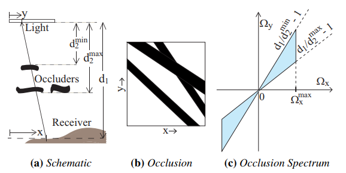
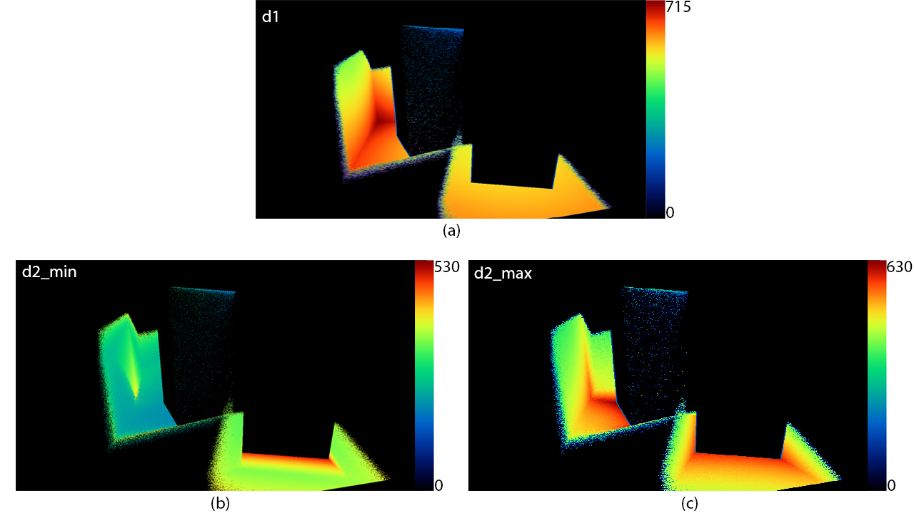
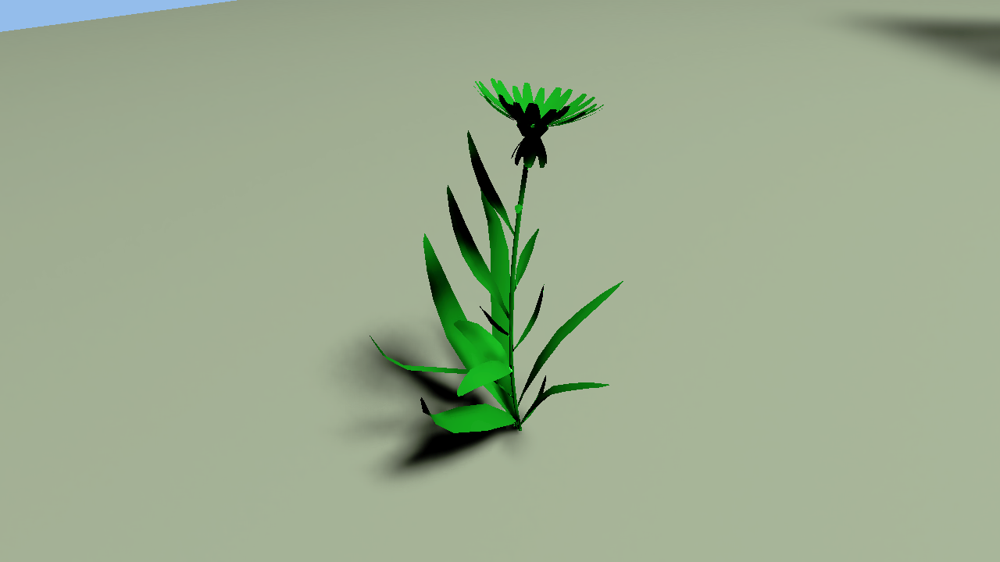
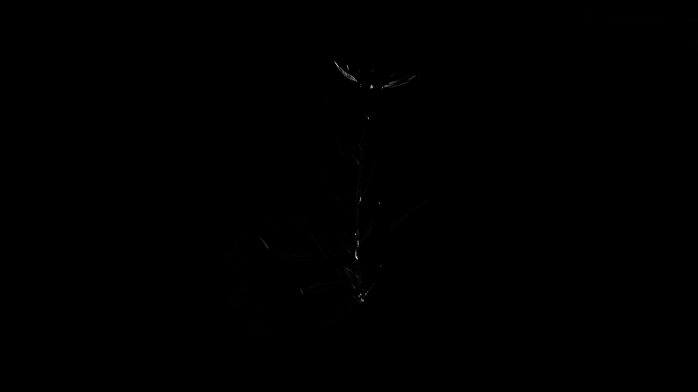

# Implementation of Axis-Aligned Filtering for Interactive Sampled Soft Shadows
## by Asbjoern Lystrup and Marcus Loo Vergara

## Background

This project details our implementation soft shadows based on the paper [*Axis-Aligned Filtering for Interactive Sampled Soft Shadows*](http://graphics.berkeley.edu/papers/UdayMehta-AAF-2012-12/) by Soham Uday Mehta, Brandon Wang, and Ravi Ramamoorthi. The paper  describes a way of approximating Monte Carlo based soft shadows, by analysing the Fourier spectrum of the occlusion function, and thereby doing smart sampling and reconstruction of the shadows. Here's a quick summary of the method:

  

Given a planar area light source, we sample the distances from the geometry to the light source, and the max and min distance from the occluder to the light source, shown in the figure above as d1, d2 respectively. This gives us the 2 dimensinal occlusion function *(b)*, on which we can calculate the Fourier spectrum *(c)*. Figure *(c)* shows that the occlusion function (shadows) can confined within a double-wedge which is be described in terms of _d1_ and _d2_. By only considering samples within this double-wedge, we can substantially reduce the amount of samples we need for a good reconstruction by blurring more at high-frequency regions than in low-frequency regions  - this is the main idea of the paper.

The paper's method derives from recent work on frequency analysis and sheared filtering for offline soft shadows. The paper develops a theoretical analysis for axis-aligned filtering. After setting up the foundation of the implementation, we spent some time studying fourier spectrums to get a better idea of the paper's theory.

## Implementation

The implementation can be found [here](https://github.com/bitsauce/Axis-Aligned-Filtering-for-Interactive-Sampled-Soft-Shadows-Implementation). Our implementation uses NVIDIA's [OptiX](https://developer.nvidia.com/optix) to do real-time raytracing.

In our implementation we start off by casting one ray per pixel to find the primary geometry hit. From this hit location, we now cast 9 rays per pixel towards 9 random points the area light source. This gives us values for _d2_max_ and _d2_min_ as illustrated below.

  

(a) shows the values of _d1_ for every pixel, and is just the euclidean distance from the primary geometry hit to the center of the light source. (b) shows the smallest distance from the closest occluder to the light source out of the 9 _d2_ values that were sampled. Conversely, (c) shows the maximum _d2_ that was sampled out of the 9. We observe that _d2_min_ is biggest near the corners of the boxes. This makes sense, since in corners, most rays hit the box pretty far from the light source. In areas away from the box, _d2_min_ and _d2_max_ vary a lot more than in corners. We will exploit this to apply a spatially varying gaussian blur later.

  

While we sample the 9 values for _d2_, we also sample the intensity of the color, giving us the noisy output we will blur later, as seen above.

So, now we have _d1_, _d2_min_ and _d2_max_. At this point we do adaptive sampling.

These values are used to find filter widths for blurring the noise, and an additional sample count to further enhance accuracy in the most complex areas of the shadows. Then the filtering is applied. The filtering is axis-aligned and done in image-space, providing great performance and making interaction possible.

We continued working on our implementation and added occlusion calculation and debugging functionality. For the occlusion calculation, nine rays per pixel are sent toward random points on the light source to obtain distances between the light source and the closest and furthest occluder. We approximate the distance between the light source and the pixels by using the center of the light source. In the same pass, we calculate the filter widths using the equations from the paper and store them in a float buffer. The debugging functionality we implemented let us use the arrow keys to move back and forth to look at different buffers, visualized by normalizing the buffer to make the greatest value correspond to white, and the lowest to black. It also let us see the minimum, average, and maximum value in text form, as well as the framerate.

We then implemented the axis-aligned filtering. We separate the filtering into two passes based on separable convolution; a pass that blurs the shadows horizontally, followed by a pass that blurs the first pass' result vertically. The computed filter widths correspond to standard deviations in a spatially varying gaussian blur. To avoid sampling from other objects, we created an object ID buffer where each object's pixels gets its own unique value.

We went back to the pass for the filter width calculation, and implemented adaptive sampling. The adaptive sampling is used to improve both the diffuse accuracy and the filter widths, and is based on the equations from the paper, which uses the occlusion distances. We use an upper limit of 100 samples per pixel. To compare our results with ground truth, we extended our debugging tools to generate three images upon a button press; a filtered result image, a ground truth image, and a disparity map.

As of this time, we had quite decent results, and we held a presentation of our project in class. Our filtering used gaussian offsets corresponding to image-space pixel positions. We had started writing code for world-space based gaussian offsets, but it wasn't complete, so we continued to work on this. The approach we used was to compute and store the 2D light-parallel position of each pixel in the same pass as the filter width and adaptive sampling calculations. To compute the positions, we created a change-of-basis matrix using the light's vectors, with the normal vector in the third column, then multiplied it by each pixel's world position and discarded the z-component. In the filter passes, we used the distance between the center pixel and the neighboring pixels' light-parallel positions as gaussian offsets, in accordance to the theory of the paper. Surprisingly enough, the results we obtained were nearly identical to the results from the original image-space offsets, also when comparing the disparity maps. So you could skip this step and use the image-space offsets to get a small performance boost, but this might also cause you to run into artefacts under certain scenarios as it is not as physically accurate as the world-space based offsets.

  

  

  

  

In addition to this, we added some new models to better test self-shadowing and complex shadows. We extended our filter's object ID check to also compare normals; each sample is required to be within a specified angle of the center sample to be included in the blurred result. We also added a filter that averages the occlusion distances in a 10x10 pixel area for completely unoccluded pixels to reduce noise for these pixels. Like our main filter, this filter also consists of two passes and is based on separable convolution. Besides this, we changed the grayscale debug visualization to a heatmap.

From this we have learned that physically accurate soft shadows can be sampled very efficiently at interactive framerates. The paper was published in 2012, and we can see clear improvements in framerate after having tested our implementation on newer graphics cards. The paper used an NVIDIA GTX 570 for its test results. We used one of today's corresponding models, the NVIDIA GTX 970. From hardware evolution, as well as from research progress in the area, we can see that we are getting closer and closer to raytracing being a viable option for real-time applications.
